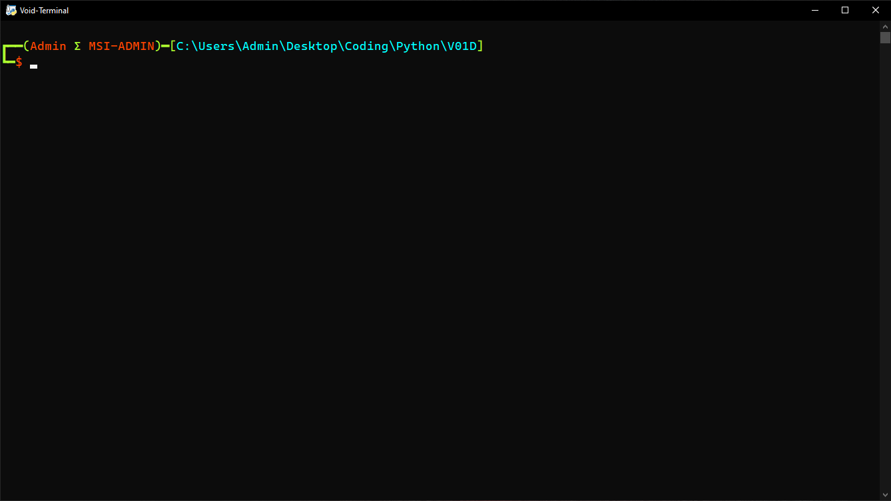

# V01D-Terminal

Easy to use **Windows** terminal made by **Stax124**

Sha256sum of dist/Void/Void.exe:
**d0f06c1d8ac349b86d01b0bb8cb9860702f8574737f79f9046c465766561af49**

V01D-Terminal is **Python** based terminal application build on Prompt-toolkit library.

# Basic functions:
  - Execute wide range of commands from cmd and powershell
  - Calculator
  - User defined alias
  - URL file download
  - Hashing (md5,sha)
  - Wifi password recovery
  - Quick access to administrative functions
  - Get component info (cpu, gpu ... )
